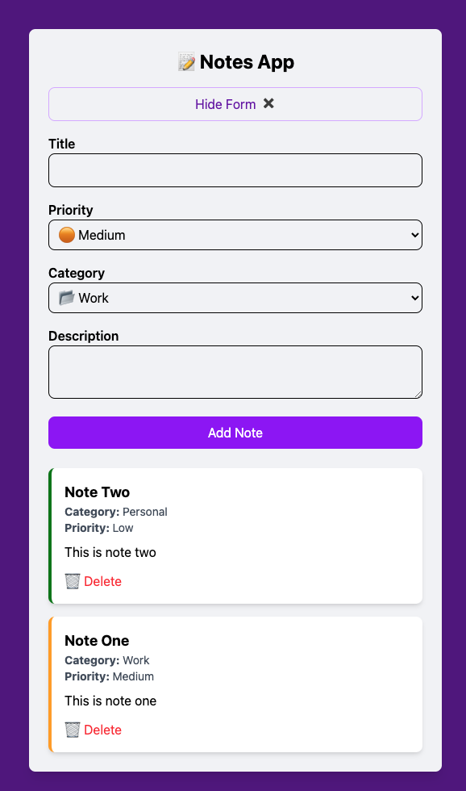

# Notes App

A clean and responsive React note-taking application built to demonstrate working with forms, component state, local storage, and Tailwind CSS styling.



## Overview

This app lets users create, view, and delete notes with the following attributes:

- Title
- Category (Work, Personal, Ideas)
- Priority (High, Medium, Low)
- Description

Notes persist in the browser using `localStorage`, so entries remain available after refresh.

## Features

- Add new notes with structured fields
- Toggle the note creation form for a cleaner UI
- Display notes in a responsive card layout
- Priority-based visual accent using color indicators
- Delete notes with confirmation
- Persist notes locally across browser sessions

## Built With

- React 19
- Vite
- Tailwind CSS
- ESLint

## Installation

```bash
npm install
```

## Running Locally

```bash
npm run dev
```

Then open the local development URL shown in the terminal.

## Available Scripts

- `npm run dev` - Start the development server
- `npm run build` - Build the production bundle
- `npm run preview` - Preview the production build locally
- `npm run lint` - Run ESLint checks across the project

## Project Structure

- `src/App.jsx` - Main application container and state management
- `src/components/NoteForm.jsx` - Note entry form with validation
- `src/components/NoteList.jsx` - List and empty-state display
- `src/components/Note.jsx` - Individual note card component
- `src/components/inputs/*` - Reusable input components

## Notes

The app stores notes in browser local storage under the key `notes`, so your data remains available between page refreshes.

## License

This project is provided as-is for learning and demonstration purposes.
